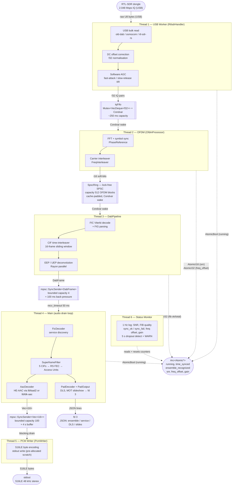

<div align="center">

# dabctl

**RTL-SDR → PCM audio pipeline for DAB+ radio, written in Rust**

Current OFDM synchronization and reacquisition behavior is aligned with
[DABstar](https://github.com/tomneda/DABstar), with a direct
**RTL-SDR → PCM** runtime pipeline and metadata output.

[](https://www.rust-lang.org/)
[](LICENSE)

</div>

---

## Quick start

```bash
# 1. Install dependencies (Debian/Ubuntu)
sudo apt install -y cmake git libusb-1.0-0-dev pkg-config build-essential libfaad-dev

# 2. Fetch the vendored RTL-SDR submodule
git submodule update --init vendor/old-dab-rtlsdr

# 3. Build (old-dab/rtlsdr backend compiled automatically)
cargo build --release

# 4. Listen — channel 6C, service NRJ (SID 0xF2F8)
sudo ./target/release/dabctl -C 6C -s 0xF2F8 \
  | ffplay -f s16le -ar 48000 -ac 2 -nodisp -i -
```

Audio output is **signed 16-bit PCM, stereo, 48 kHz** on stdout.
Only **DAB+** services (HE-AAC) are decoded; classic DAB (MP2) is not supported.

---

## Prerequisites

### System packages

| Package | Role |
|---|---|
| `cmake`, `git` | Build the vendored old-dab/rtlsdr library |
| `libusb-1.0-0-dev` | USB backend for RTL-SDR |
| `pkg-config` | Library discovery |
| `build-essential` | C compiler (required by libfaad2 / libfdk-aac and CMake builds) |
| `libfaad-dev` | AAC decoder for DAB+ (default backend) |
| `libfdk-aac-dev` | Alternative AAC decoder — Fraunhofer FDK (optional, `fdk-aac` feature) |

> `libfdk-aac-dev` is in the `non-free` component on Debian (Fraunhofer audio patents).
> Use the default **faad2** backend unless FDK-AAC quality is specifically required.

```bash
# Common deps (all RTL-SDR backends)
sudo apt install -y cmake git libusb-1.0-0-dev pkg-config build-essential libfaad-dev

# fdk-aac backend — enable non-free first on Debian Trixie
sudo sed -i 's/Components: main$/Components: main non-free/' /etc/apt/sources.list.d/debian.sources
sudo apt update && sudo apt install -y libfdk-aac-dev

# osmocom system librtlsdr-dev (only needed for the rtl-sdr-osmocom feature)
sudo apt install -y librtlsdr-dev
```

### Hardware

- RTL-SDR dongle (RTL2832U / R820T2 chipset)
- DAB Band III antenna (174–240 MHz)

### Rust

```bash
curl --proto '=https' --tlsv1.2 -sSf https://sh.rustup.rs | sh
```

---

## Building

### RTL-SDR backend

Three RTL-SDR driver backends are available, selected at compile time via Cargo features.
Exactly one backend must be active.

| Feature | Type | How to build |
|---|---|---|
| `rtl-sdr-old-dab` *(default)* | Vendored C — [old-dab/rtlsdr](https://github.com/old-dab/rtlsdr) built from source via CMake, linked statically. No install step; just run `git submodule update --init vendor/old-dab-rtlsdr` first. | `cargo build --release` |
| `rtl-sdr-osmocom` | System C — links against the installed `librtlsdr-dev` (osmocom fork). Requires `sudo apt install librtlsdr-dev`. | `cargo build --release --no-default-features --features rtl-sdr-osmocom` |
| `rtl-sdr-rs` | Pure Rust — [`rtl-sdr-rs`](https://github.com/ccostes/rtl-sdr-rs) crate via `rusb`. No `libclang` or CMake required. | `cargo build --release --no-default-features --features rtl-sdr-rs` |

> The old-dab and osmocom forks expose the same C API (`rtlsdr_open`, `rtlsdr_read_sync`, …)
> and share the same Rust FFI handler. The `rtl-sdr-rs` backend uses a different handler
> built on the `rtl-sdr-rs` crate.

### AAC decoder backend

```bash
cargo build --release                        # faad2 (default)
cargo build --release --features fdk-aac    # Fraunhofer FDK-AAC
```

With `--features fdk-aac`, both libraries are linked and the backend is selected at
runtime via `--aac-decoder`.

### Combined examples

```bash
# Default: old-dab/rtlsdr + faad2
cargo build --release

# old-dab/rtlsdr + fdk-aac
cargo build --release --features fdk-aac

# osmocom system librtlsdr + faad2
cargo build --release --no-default-features --features rtl-sdr-osmocom

# Pure-Rust rtl-sdr-rs + faad2
cargo build --release --no-default-features --features rtl-sdr-rs
```

### Dev Container

A ready-to-use devcontainer is provided for VS Code and GitHub Codespaces
(`.devcontainer/devcontainer.json`). It installs all system dependencies on creation.

1. Install the **Dev Containers** extension in VS Code.
2. **Ctrl+Shift+P** → `Dev Containers: Reopen in Container`.
3. `cargo build --release`.

---

## CLI reference

```
dabctl -C <channel> -s <sid> [options]
```

| Option | Short | Description | Default |
|---|---|---|---|
| `--channel` | `-C` | DAB channel (e.g. `5A`, `6C`, `11C`) | **required** |
| `--sid` | `-s` | Service ID in hex (e.g. `0xF2F8`) | **required** |
| `--gain` | `-G` | Manual tuner gain in % (0–100), mutually exclusive with all AGC modes | — |
| `--hardware-agc` | | Use the RTL-SDR chip's built-in hardware AGC | off |
| `--driver-agc` | | Use the old-dab driver AGC when the selected backend supports it | off |
| `--software-agc` | | Force the application software SAGC loop explicitly | off |
| `--ppm` | `-p` | Frequency correction in PPM | `0` |
| `--sync-time` | `-d` | Sync timeout in seconds | `5` |
| `--detect-time` | `-D` | Ensemble detection timeout in seconds | `10` |
| `--label` | `-l` | Select service by label instead of SID | — |
| `--disable-dyn-fic` | `-F` | Suppress FIC log messages on stderr | off |
| `--slide-dir` | `-S` | Save slideshow images to this directory | — |
| `--slide-base64` | | Include slideshow images as base64 in JSON output | off |
| `--no-silence-fill` | | Emit nothing instead of silence during radio fades | off |
| `--silent` | | No log output on stderr | off |
| `--trace-ofdm` | | Emit dedicated OFDM sync, correlation and AFC trace logs | off |
| `--device-index` | | RTL-SDR dongle index | `0` |
| `--offset-tuning` | | Tune the hardware above the DAB channel and digitally rotate back to move LO spur energy away from low subcarriers | off |
| `--no-iq-correction` | | Disable the default IQ imbalance correction loop | off |
| `--aac-decoder` | | AAC backend: `faad2` or `fdk-aac` (requires the `fdk-aac` feature) | `faad2` |

Band III channels span **5A–13F** (174.928–239.200 MHz).
L-Band channels (LA–LP, 1452–1478 MHz) are also supported.

### Metadata output (fd 3)

JSON events are emitted one per line on file descriptor 3:

```json
{"ensemble":{"eid":"0x1000","label":"DAB+ France"}}
{"service":{"sid":"0xF2F8","label":"NRJ"}}
{"dl":"NRJ - Ed Sheeran - Shape Of You"}
{"slide":{"contentName":"cover.jpg","contentType":"image/jpeg","data":"<base64>"}}
```

Redirect with: `3>metadata.json`

---

## Examples

```bash
# Software AGC (default runtime behavior)
sudo ./target/release/dabctl -C 6C -s 0xF2F8 \
  | ffplay -f s16le -ar 48000 -ac 2 -nodisp -i -

# Force application software SAGC explicitly
sudo ./target/release/dabctl -C 6C -s 0xF2F8 --software-agc \
  | ffplay -f s16le -ar 48000 -ac 2 -nodisp -i -

# Driver AGC on supported old-dab / osmocom style backends
sudo ./target/release/dabctl -C 6C -s 0xF2F8 --driver-agc \
  | ffplay -f s16le -ar 48000 -ac 2 -nodisp -i -

# Manual gain + frequency correction
sudo ./target/release/dabctl -C 6C -s 0xF2F8 -G 20 -p 2 \
  | ffplay -f s16le -ar 48000 -ac 2 -nodisp -i -

# aplay instead of ffplay
sudo ./target/release/dabctl -C 11C -s 0xF2F8 -G 50 \
  | aplay -f S16_LE -r 48000 -c 2

# Capture slideshow and DLS metadata
sudo ./target/release/dabctl -C 6C -s 0xF2F8 \
  --slide-dir /tmp/slides --slide-base64 3>pad_metadata.json \
  | ffplay -f s16le -ar 48000 -ac 2 -nodisp -i -

# Convert to WAV
sudo ./target/release/dabctl -C 6C -s 0xF2F8 -G 20 \
  | sox -t raw -r 48000 -b 16 -c 2 -e signed-integer -L - output.wav

# Automated capture helper script
./live-capture-iq2pcm.sh 6C 0xF2F8 20
```

---

## Architecture

### Synchronization reference

The active synchronization path is intentionally modeled on DABstar and the ETSI DAB specification:

- null-symbol timing detection via a sliding short-term level window
- phase-reference correlation for symbol-0 alignment
- sync-symbol coarse frequency correction gated by FIC quality
- cyclic-prefix fine frequency tracking and per-carrier phase correction

Normative reference: ETSI EN 300 401, especially sections 8.4 and 14.5 to 14.8.

### Source tree

```
build.rs                        RTL-SDR backend selection (cmake / bindgen / link) + faad2 / fdk-aac
vendor/
  old-dab-rtlsdr/               Vendored old-dab/rtlsdr C library (git submodule)
src/
  main.rs                       CLI entry point (clap) → pipeline
  lib.rs                        Module declarations
  iq2pcm_cmd.rs                 Main pipeline: RTL-SDR → PCM
  device/
    mod.rs                      Backend selection via #[cfg(feature)]
    rtlsdr_handler_osmocom.rs   FFI handler shared by old-dab and osmocom backends
    rtlsdr_handler_rs.rs        Handler for the pure-Rust rtl-sdr-rs backend
  pipeline/
    dab_constants.rs            Constants, CRC helpers, bit utilities
    dab_frame.rs                DabFrame — in-process FIC + subchannel transport
    dab_params.rs               DAB Mode I–IV parameters (ETSI EN 300 401 §14)
    band_handler.rs             Channel name → centre frequency
    ringbuffer.rs               Thread-safe IQ ring buffer (SPSC)
    subchannel_pool.rs          Pre-allocated subchannel buffer pool
    dab_pipeline.rs             DabPipeline: OFDM blocks → DabFrame via mpsc
    fib_processor.rs            FIG 0/0, 0/1, FIG 1 parsing
    fic_handler.rs              FIC depuncturing and Viterbi decoding
    viterbi_handler.rs          Viterbi decoder {0155,0117,0123,0155}
    prot_tables.rs              24 puncturing tables (ETSI EN 300 401 §11)
    protection.rs               EEP + UEP deconvolution
    ofdm/
      phase_table.rs            Mode I phase reference table
      time_syncer.rs            DABstar-style null-symbol timing detector
      phase_reference.rs        DABstar-style sync correlation + coarse offset
      freq_interleaver.rs       Carrier frequency interleaving
      ofdm_processor.rs         DABstar-style OFDM synchronization and demodulation loop
  audio/
    fic_decoder.rs              FIC/FIG service discovery (FIG 0/0, 0/1, 0/2, 1/0, 1/1)
    superframe.rs               DAB+ superframe: 5 CIFs → Reed-Solomon FEC → AUs
    rs_decoder.rs               Reed-Solomon (120,110) over GF(2^8), pure Rust
    aac_decoder/
      mod.rs                    AAC decoder trait + runtime backend selection
      faad2.rs                  FFI binding to libfaad2
      fdkaac.rs                 FFI binding to libfdk-aac
    pad_decoder.rs              F-PAD + X-PAD, DLS (Dynamic Label), MOT slideshow
    pad_output.rs               JSON metadata + slideshow output on fd 3
    mot_decoder.rs              X-PAD → MOT DataGroups (accumulation + CRC)
    mot_manager.rs              MOT DataGroups → complete MOT object (JPEG/PNG)
    crc.rs                      CRC-16-CCITT and Fire Code
    ebu_latin.rs                EBU Latin-1 → UTF-8 (ETSI EN 300 401 §8.1.1.1)
```

### Thread model

`dabctl` runs **six threads**. Each stage is decoupled by a bounded channel that acts
as both a data bus and a back-pressure valve.



| Thread | Role | Spawned by |
|---|---|---|
| **1 — USB Worker** | Reads raw IQ bytes from the RTL-SDR over USB, applies DC offset correction and software AGC (SAGC), and pushes normalised `f32` IQ pairs into `IqFifo`. | `RtlsdrHandler::restart_reader()` |
| **2 — OFDM** | Reads IQ from `IqFifo`, runs FFT, symbol synchronisation, phase correction, and carrier frequency interleaving (ETSI EN 300 401 §8). Writes `i16` soft-bits into `SpscRing`. | `iq2pcm_cmd::run()` |
| **3 — DabPipeline** | Reads OFDM soft-bits from `SpscRing`, performs FIC Viterbi decode and FIG parsing, applies the 16-frame CIF time-interleaver, and runs EEP/UEP subchannel deconvolution via Rayon (parallel when more than one sub-channel is active, sequential otherwise to avoid work-stealing overhead). Emits one `DabFrame` per CIF through a bounded `mpsc` channel (capacity 4 ≈ 100 ms of back-pressure). | `DabPipeline::new()` |
| **4 — Main** | Receives `DabFrame` values through `recv_timeout(50 ms)` so a Ctrl-C can break the loop even when the channel is empty. Drives `FicDecoder` for service discovery, `SuperframeFilter` → Reed-Solomon → `AacDecoder` for HE-AAC (DAB+) audio, and `PadDecoder` → `PadOutput` for DLS and MOT slideshow metadata. Pushes PCM frames non-blocking to `PcmWriter`. | main thread |
| **5 — PCM Writer** | Owns stdout. Receives owned `Vec<i16>` frames from a bounded channel (capacity 100 ≈ 4 s), converts them to S16LE bytes using a pre-allocated scratch buffer, and writes to stdout. Decouples transient pipe stalls from the audio decode loop, preventing backpressure from reaching the OFDM ring buffer. | `pcm_writer::spawn_pcm_writer()` |
| **6 — Status Monitor** | Wakes once per second to log SNR, FIB CRC quality, sync_ok/sync_fail counts, frequency offset, and tuner gain. Reads counters from `Arc<Atomic*>` and resets them each tick so values reflect the last 1 s window. Emits a `WARN` after five consecutive seconds where failures outnumber successes. Exits when `run` is cleared by the Ctrl-C handler. | `iq2pcm_cmd::run()` |

### Back-pressure and shutdown

Each channel in the pipeline is **bounded**, so a slow stage blocks its producer
rather than growing an unbounded queue:

- `IqFifo` (~250 ms) — the USB worker blocks on a Condvar until the OFDM thread drains samples.
- `SpscRing` (512 slots) — if the DabPipeline thread is slow, the OFDM thread drops the block and logs a warning.
- `mpsc::SyncSender<DabFrame>` (capacity 4) — the DabPipeline thread blocks until the audio drain loop picks up a frame.
- `mpsc::SyncSender<Vec<i16>>` (capacity 100) — the audio drain loop drops the frame and logs a warning if the PCM writer is stalled.

On **Ctrl-C** or end-of-record:
1. `running` and `run` atomics are set to `false` by the Ctrl-C handler.
2. The status monitor exits its `while run` loop (it does not touch `running`).
3. The audio drain loop breaks out of `recv_timeout`, then sets `running = false` and `rtlsdr_running = false`.
4. Setting `rtlsdr_running = false` unblocks the USB worker's `read_sync` call so `RtlsdrHandler::drop` does not stall.
5. `ofdm_thread.join()` waits for the OFDM thread and DabPipeline to drain.

> **Rayon thread pool** — `DabPipeline` uses Rayon for parallel sub-channel deconvolution.
> Rayon maintains a global thread pool sized to `num_cpus - 1` by default. On a 4-core device
> (e.g. Raspberry Pi 4), the total thread count is **6 + 3 = 9**.

### Data flow

```
RTL-SDR (2.048 MHz IQ)
  └─ RtlsdrHandler — USB Worker (Thread 1)
       └─ OfdmProcessor (Thread 2) — FFT, symbol sync, carrier interleaving
            └─ DabPipeline (Thread 3) — FIC + CIF → DabFrame
                 ├─ FicDecoder — service discovery via FIG parsing
                 └─ SuperframeFilter — 5 CIFs → RS FEC → Access Units
                      ├─ AacDecoder (HE-AAC) → 16-bit PCM → PcmWriter (Thread 5) → stdout
                      └─ PadDecoder (DLS + MOT slideshow)
                           └─ PadOutput → JSON events on fd 3
```

---

## Cross-compilation

### ARM64 (Raspberry Pi 3/4, 64-bit)

```bash
rustup target add aarch64-unknown-linux-gnu
sudo apt install -y gcc-aarch64-linux-gnu libc6-dev-arm64-cross
cargo build --release --target aarch64-unknown-linux-gnu
scp target/aarch64-unknown-linux-gnu/release/dabctl user@rpi:/usr/local/bin/
```

### ARM32 (Raspberry Pi 2/3, 32-bit)

```bash
rustup target add armv7-unknown-linux-gnueabihf
sudo apt install -y gcc-arm-linux-gnueabihf
cargo build --release --target armv7-unknown-linux-gnueabihf
```

Add linker entries to `.cargo/config.toml`:

```toml
[target.aarch64-unknown-linux-gnu]
linker = "aarch64-linux-gnu-gcc"

[target.armv7-unknown-linux-gnueabihf]
linker = "arm-linux-gnueabihf-gcc"
```

On the target device, install `libusb-1.0-0` and `libfaad2` (or `libfdk-aac2`), then
copy the binary to `/usr/local/bin/`.

---

## Troubleshooting

**`No RTL-SDR devices found`**

The kernel DVB driver claims the device before `dabctl` can open it. Blacklist it:

```bash
sudo rmmod dvb_usb_rtl28xxu 2>/dev/null
echo "blacklist dvb_usb_rtl28xxu" | sudo tee /etc/modprobe.d/rtlsdr.conf
```

**No sync / weak signal**

Try a higher fixed gain (`-G 80`) or omit `-G` entirely to let software AGC adapt.
Check that the antenna is connected and oriented vertically for Band III.

**Garbled audio / decoder errors**

Try the alternative AAC backend (requires a `--features fdk-aac` build):

```bash
sudo ./target/release/dabctl -C 6C -s 0xF2F8 --aac-decoder fdk-aac | ffplay …
```

---

## Stability Campaign Runbook

This runbook defines repeatable long-run checks using the 1 Hz `status` logs:

- `sync_ok` / `sync_fail` — OFDM superframe decode health over the last second
- `dls_events` / `slide_events` — metadata continuity emitted in the same second
- `metadata_blackout=true` — degraded second with no DLS/slide events

### 1) Run a capture campaign

Use the helper script (writes logs to `test-local/iq2pcm.log`):

```bash
bash live-capture-iq2pcm.sh 8C 0xF201
```

Or run `dabctl` directly and save stderr logs:

```bash
sudo RUST_LOG=info,dabctl=debug ./target/release/dabctl -C 8C -s 0xF201 \
  --slide-dir /tmp/slides --slide-base64 3>pad_metadata.json \
  2>iq2pcm.log | ffmpeg -y -f s16le -ar 48000 -ac 2 -i pipe:0 output.wav
```

### 2) Compute campaign metrics from logs

Count sampled status seconds:

```bash
grep -c " status " iq2pcm.log
```

Count degraded seconds (`sync_fail > sync_ok`) and blackout seconds:

```bash
awk '
  / status / {
    sok=sf=dls=sld=0;
    for (i=1; i<=NF; i++) {
      if ($i ~ /^sync_ok=/) { split($i,a,"="); sok=a[2]+0 }
      else if ($i ~ /^sync_fail=/) { split($i,a,"="); sf=a[2]+0 }
      else if ($i ~ /^dls_events=/) { split($i,a,"="); dls=a[2]+0 }
      else if ($i ~ /^slide_events=/) { split($i,a,"="); sld=a[2]+0 }
      else if ($i ~ /^metadata_blackout=/) { split($i,a,"="); mb=(a[2]=="true") }
    }
    secs++;
    if (sf > sok) drop++;
    if (mb || ((sf > sok) && dls==0 && sld==0)) black++;
  }
  END {
    if (secs==0) { print "no status lines"; exit 1 }
    printf("secs=%d drop=%d black=%d drop_pct=%.1f black_pct=%.1f\n",
      secs, drop, black, 100*drop/secs, 100*black/secs)
  }
' iq2pcm.log
```

### 3) Acceptance thresholds (ETSI-TDD campaign)

| Window | Max dropout % | Max blackout % |
|---|---:|---:|
| 5 min (300 s) | 40% | 20% |
| 15 min (900 s) | 30% | 15% |
| 30 min (1800 s) | 20% | 10% |

These thresholds are enforced by log-driven tests in the codebase and should be
used as operator acceptance gates for RF stability campaigns.

---

## Man page

```bash
man ./dabctl.1                                          # view locally

sudo install -m 644 dabctl.1 /usr/local/share/man/man1/
sudo mandb
man dabctl
```

---

## References

### Upstream projects

| Project | Role |
|---|---|
| [eti-cmdline](https://github.com/JvanKatwijk/eti-stuff/tree/master/eti-cmdline) | Reference C++ IQ → ETI implementation — base for the signal processing chain |
| [dablin](https://github.com/Opendigitalradio/dablin) | Reference C++ ETI → audio decoder — base for the audio pipeline |
| [AbracaDABra](https://github.com/KejPi/AbracaDABra) | Software AGC and AAC backend selection strategy (MIT licence) |
| [old-dab/rtlsdr](https://github.com/old-dab/rtlsdr) | Enhanced RTL-SDR C library — default vendored backend (GPL-2.0) |
| [rtl-sdr-rs](https://github.com/ccostes/rtl-sdr-rs) | Pure-Rust RTL-SDR driver (via `rusb`) |
| [osmocom/rtl-sdr](https://github.com/osmocom/rtl-sdr) | Original RTL-SDR C library — available as `rtl-sdr-osmocom` feature |

### ETSI standards

| Standard | Title |
|---|---|
| [ETSI EN 300 401](https://www.etsi.org/deliver/etsi_en/300400_300499/300401/02.01.01_60/en_300401v020101p.pdf) | Radio Broadcasting Systems; Digital Audio Broadcasting — core system spec (OFDM, FIC, CIF, protection) |
| [ETSI TS 102 563](https://www.etsi.org/deliver/etsi_ts/102500_102599/102563/02.01.01_60/ts_102563v020101p.pdf) | DAB+ audio coding (HE-AAC v2) |
| [ETSI TS 103 466](https://www.etsi.org/deliver/etsi_ts/103400_103499/103466/01.02.01_60/ts_103466v010201p.pdf) | DAB audio coding (MPEG-1 Layer II) |
| [ETSI TS 101 756](https://www.etsi.org/deliver/etsi_ts/101700_101799/101756/02.04.01_60/ts_101756v020401p.pdf) | Registered tables (SId, language codes, country codes, service types) |
| [ETSI ETS 300 799](https://www.etsi.org/deliver/etsi_i_ets/300700_300799/300799/01_60/ets_300799e01p.pdf) | Ensemble Transport Interface (ETI-NI) |
| [ETSI EN 301 234](https://www.etsi.org/deliver/etsi_en/301200_301299/301234/02.01.01_60/en_301234v020101p.pdf) | Multimedia Object Transfer (MOT) protocol |
| [ETSI TS 101 499](https://www.etsi.org/deliver/etsi_ts/101400_101499/101499/03.01.01_60/ts_101499v030101p.pdf) | MOT Slideshow application |
| [ETSI TS 102 980](https://www.etsi.org/deliver/etsi_ts/102900_102999/102980/02.01.02_60/ts_102980v020102p.pdf) | Dynamic Label Plus (DL+) |

---

## Licence

`dabctl` is released under the **GNU General Public License v2.0** (GPL-2.0).
See the [LICENSE](LICENSE) file for the full licence text.

### Dependency licences

| Component | Licence |
|---|---|
| [eti-cmdline](https://github.com/JvanKatwijk/eti-stuff/tree/master/eti-cmdline) | GPL-2.0 |
| [dablin](https://github.com/Opendigitalradio/dablin) | GPL-2.0 |
| [AbracaDABra](https://github.com/KejPi/AbracaDABra) (software AGC) | MIT |
| [old-dab/rtlsdr](https://github.com/old-dab/rtlsdr) (default backend, vendored) | GPL-2.0 |
| [rtl-sdr-rs](https://github.com/ccostes/rtl-sdr-rs) | MIT |
| [osmocom/rtl-sdr](https://github.com/osmocom/rtl-sdr) | GPL-2.0 |
| libfaad2 | GPL-2.0 |
| libfdk-aac *(optional)* | Fraunhofer FDK AAC Codec Library Licence (non-free) |
